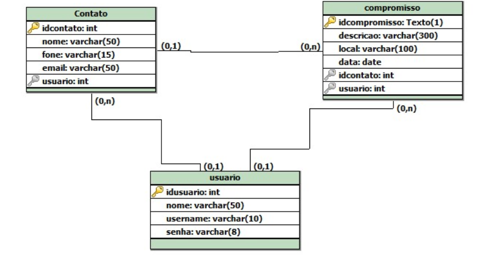

# Agenda API

Conforme o trabalho proposto pela matéria de Desenvolvimento de Sistemas Web (DSW), foi desenvolvida uma API que pudesse ser capaz de fornecer e receber dados de Usuários, Contatos e Compromissos. Abaixo, segue uma breve modelagem do problema proposto.

>Figura 1: Modelo lógico do problema proposto para ser implementado

## Resources e Endpoints

### CompromissoResource

Verbo | Endpoint | Funcionalidade
------------ | ------------- | ---
GET | /compromissos | Retorna todos os compromissos
GET | /compromissos/{id} | Retorna um compromisso especificado pelo id
GET | /compromissos/contato/{id} | Retorna todos os compromissos relacionados a um contato especificado pelo id do contato
GET | /compromissos/d1/{12-02-2019}/d2/{15-06-2021} | Retorna todos os compromissos em um determinado intervalo de data
POST | /compromissos |  Insere um compromisso no banco
DELETE | /compromissos/{id} | Deleta um compromisso especificado pelo id
PUT | /compromissos/{id} | Atualiza um compromisso especificado pelo id

### ContatoResource

Verbo | Endpoint | Funcionalidade
------------ | ------------- | ---
GET | /contatos | Retorna todos os contatos
GET | /contatos/{id} | Retorna um contato especificado pelo id
GET | /contatos/nome/{nome} | Retorna todos os contatos especificados pelo nome
POST | /contatos |  Insere um contato no banco
DELETE | /contatos/{id} | Deleta um contato especificado pelo id
PUT | /contatos/{id} | Atualiza um contato especificado pelo id

### UsuarioResource

Verbo | Endpoint | Funcionalidade
------------ | ------------- | ---
GET | /usuarios | Retorna todos os usuarios
GET | /usuarios/{id} | Retorna um usuario especificado pelo id
POST | /usuarios |  Insere um usuario no banco
DELETE | /usuarios/{id} | Deleta um usuario especificado pelo id
PUT | /usuarios/{id} | Atualiza um usuario especificado pelo id

***Obs: O arquivo application.properties está com o Profile Prod. Portanto, caso o
repositório seja clonado o usuário deve mudar a linha [spring.profiles.active=prod](***) para [spring.profiles.active=test](***) caso
queira utilizar com o H2 DB ou para [spring.profiles.active=dev](***) se quiser utilizar um Banco de Dados local.***

### Heroku

A aplicação também está disponível no Heroku e é possível fazer uso da mesma através do link  [https://agenda-trabalhodsw.herokuapp.com/]( https://agenda-trabalhodsw.herokuapp.com/)